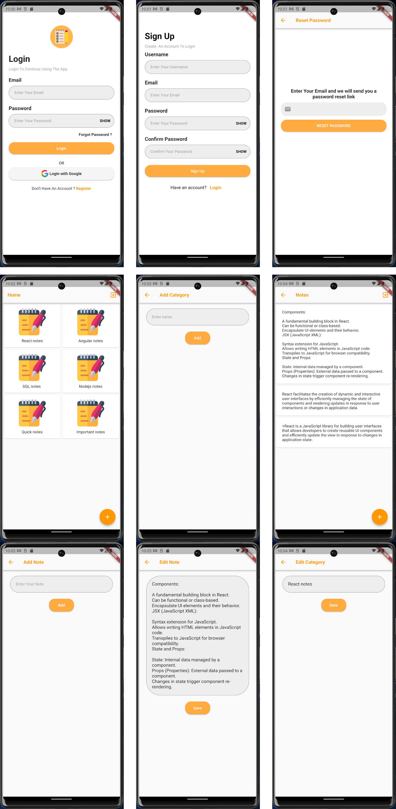

# notes_management_mobille_application

## 📋 Features
**Concept and development mobile application notes management**
- Mobile application provides users to store, and manage their notes.
- Technologies: Dart, Flutter, Firebase
## 📸 Screenshots
  


A new Flutter project.

## Getting Started

This project is a starting point for a Flutter application.

A few resources to get you started if this is your first Flutter project:


For help getting started with Flutter development, view the
[online documentation](https://docs.flutter.dev/), which offers tutorials,
samples, guidance on mobile development, and a full API reference.
## Android Release Signing

The release keystore is stored locally at `android/release/upload-keystore.jks`.
It is excluded from source control. To build a signed release locally, copy
`android/key.properties.example` to `android/key.properties` and replace the
placeholder values with the credentials for that keystore:

```properties
storeFile=release/upload-keystore.jks
storePassword=YOUR_KEYSTORE_PASSWORD
keyAlias=YOUR_KEY_ALIAS
keyPassword=YOUR_KEY_PASSWORD
```

For CI, set `ANDROID_KEYSTORE_FILE`, `ANDROID_KEYSTORE_PASSWORD`,
`ANDROID_KEY_ALIAS`, and `ANDROID_KEY_PASSWORD` as protected secrets. The
release build does not fall back to the debug signing key.

Build the release artifacts with:

```powershell
flutter build apk --release
flutter build appbundle --release
```
